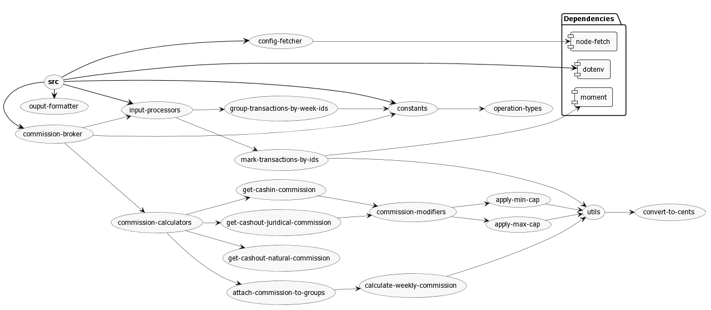

## How to Run

It's better that the Node version is >= 10.

Clone this repository and install dependecies.

```
npm i
```

This program takes a file as an input which contain transactions in JSON format. To run the
program -

```
npm start /path/to/file/input.json
```

This will print the calculated commission fees to stdout.

To run the test suits -

```
npm test
```

To run the test suits in watch mode (helpful during development)

```
npm run test:watch
```

To run the linter

```
npm run lint
```

Additionaly, linter will run before every commit.

## Program Architecture

Comments are available on the code. The following diagram might also be helpful.


